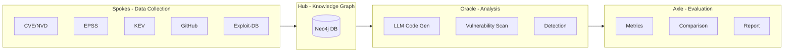

# LLMDump - Security Analysis for LLM-Generated Code

[](https://pypi.org/project/llmdump/)
[](https://www.python.org/downloads/)
[](https://opensource.org/licenses/MIT)

**LLMDump** is a research framework for detecting security vulnerabilities in **LLM-generated code**. As developers increasingly rely on AI assistants (ChatGPT, Copilot, Claude) to generate code, LLMDump measures and analyzes vulnerabilities that may be reproduced from training data.

## What is LLMDump?

### The Problem

LLMs are trained on public code repositories that contain vulnerabilities:

```
GitHub Public Repos (Training Data)
    |
Contains 11,441+ CVEs and vulnerable code patterns
    |
LLM learns patterns (including vulnerabilities)
    |
Developers use LLM to generate code
    |
Vulnerabilities reproduced in new projects
```

### LLMDump's Solution

LLMDump systematically measures and detects security risks in LLM-generated code:

1. **Baseline Data**: 11,441 CVEs, 35,080 vulnerability-fixing commits
2. **LLM Code Generation**: Generate code samples from multiple LLMs
3. **Vulnerability Scanning**: Detect vulnerabilities using static analysis
4. **Comparison Analysis**: Compare LLM vulnerability rates with historical baseline



## Quick Start

### Installation

```bash
pip install llmdump
```

### Environment Setup

Create a `.env` file:

```bash
# GitHub API (for commit collection)
GITHUB_TOKEN=your_github_token

# Gemini API (for LLM code generation)
GEMINI_API_KEY=your_gemini_api_key

# Neo4j Database (for knowledge graph)
NEO4J_URI=bolt://localhost:7687
NEO4J_USER=neo4j
NEO4J_PASSWORD=your_password
```

### Basic Workflow

```bash
# 1. Start Neo4j
docker compose up -d

# 2. Check system status
python src/scripts/check_status.py

# 3. Collect baseline data
python src/scripts/collect_data.py --all

# 4. Load data to Neo4j
python src/scripts/load_to_neo4j.py --all

# 5. Verify data
python src/scripts/check_status.py --neo4j-only
```

## Current Status

### Baseline Data (Complete)

| Source | Description | Count | Status |
|--------|-------------|-------|--------|
| **CVE/NVD** | National Vulnerability Database | 11,441 | ✅ Complete |
| **Commits** | Vulnerability-fixing commits | 35,080 | ✅ Complete |
| **CWE** | Common Weakness Enumeration | 969 | ✅ Complete |
| **KEV** | CISA Known Exploited Vulnerabilities | 1,666 | ✅ Complete |
| **EPSS** | Exploit Prediction Scores | All CVEs | ✅ Complete |
| **Exploit-DB** | Public exploits | 30+ | ✅ Complete |

### LLM Analysis (In Progress)

| Component | Description | Status |
|-----------|-------------|--------|
| LLM Code Generation | Generate code from CVE-based prompts | 🔄 In Progress |
| Vulnerability Scanning | Bandit, Semgrep integration | 🔄 In Progress |
| Comparison Analysis | Historical vs LLM vulnerability rates | 🔄 Planned |

## Architecture

### Spokes (Data Collection)

```bash
# Collect all baseline data
python src/scripts/collect_data.py --all

# Collect specific sources
python src/scripts/collect_data.py --cve --start-date 2024-01-01 --end-date 2024-12-31
python src/scripts/collect_data.py --epss
python src/scripts/collect_data.py --kev
python src/scripts/collect_data.py --commits --repository django/django --days-back 30
```

**Python API**:

```python
from llmdump.spokes import CVECollector, EPSSCollector, KEVCollector
from llmdump.spokes.github import GitHubSignalsCollector
import os

# Collect CVE data
cve_collector = CVECollector()
stats = cve_collector.collect(
    start_date="2025-01-01",
    end_date="2025-01-31"
)

# Collect GitHub signals
github_collector = GitHubSignalsCollector(token=os.getenv("GITHUB_TOKEN"))
stats = github_collector.collect("django/django", days_back=30)
```

### Hub (Data Integration)

```bash
# Load all data to Neo4j
python src/scripts/load_to_neo4j.py --all

# Load specific sources
python src/scripts/load_to_neo4j.py --cve
python src/scripts/load_to_neo4j.py --commits
```

**Python API**:

```python
from llmdump.hub import Neo4jConnection, DataLoader
from pathlib import Path

with Neo4jConnection() as conn:
    loader = DataLoader(conn)
    stats = loader.load_cve_data(Path("data/input/cve.jsonl"))
```

### Oracle (Prediction)

```python
from llmdump.oracle import VulnerabilityOracle
import os

# Initialize oracle
oracle = VulnerabilityOracle(
    api_key=os.getenv("GEMINI_API_KEY"),
    neo4j_uri=os.getenv("NEO4J_URI"),
    neo4j_password=os.getenv("NEO4J_PASSWORD"),
    use_rag=True
)

# Predict vulnerability risk
prediction = oracle.predict("django/django", github_signals=signals)
print(f"Risk Score: {prediction.risk_score}")
print(f"Risk Level: {prediction.risk_level}")
```

## Data Directory Structure

```
data/
├── input/                  # Consolidated input data
│   ├── cve.jsonl           # CVE data from NVD
│   ├── commits.jsonl       # GitHub commits
│   ├── epss.jsonl          # EPSS scores
│   ├── kev.jsonl           # KEV catalog
│   ├── exploits.jsonl      # Exploit-DB data
│   └── advisory.jsonl      # GitHub advisories
│
└── output/                 # Analysis results
    ├── analysis/           # Analysis outputs
    ├── predictions/        # Prediction results
    └── llm_code/           # LLM-generated code samples (planned)
```

## Research Goals

### Primary Research Questions

**RQ1**: Do LLMs reproduce known vulnerability patterns from their training data?

**RQ2**: How does vulnerability rate in LLM-generated code compare to historical rates?

### Methodology

1. **Baseline**: Use 11,441 CVEs and 35,080 commits as historical baseline
2. **Generation**: Generate 10,000+ code samples from LLMs using CVE-based prompts
3. **Scanning**: Detect vulnerabilities using Bandit, Semgrep, CodeQL
4. **Analysis**: Compare vulnerability rates and CWE distributions

### Expected Outcomes

- Vulnerability reproduction rate measurement
- Comparison of LLM vs historical vulnerability rates
- CWE distribution analysis
- Detection recommendations

## Documentation

- **[User Guide](docs/GUIDE.md)** - Complete usage guide
- **[Development Guide](docs/DEVELOPMENT.md)** - Development and releases
- **[Research Plan](docs/RESEARCH.md)** - Detailed research methodology

## Configuration

Create `config.yaml`:

```yaml
data_dir: data
neo4j_uri: bolt://localhost:7687
neo4j_user: neo4j
neo4j_password: your_password
request_timeout: 30.0
rate_limit_sleep: 1.0
```

## Testing

```bash
# Check system status
python src/scripts/check_status.py

# Test data collection (small dataset)
python src/scripts/collect_data.py --cve --start-date 2024-01-01 --end-date 2024-01-07

# Test Neo4j loading
python src/scripts/load_to_neo4j.py --cve

# Verify
python src/scripts/check_status.py --neo4j-only
```

## Future Plans

- [ ] LLM code generation pipeline
- [ ] Vulnerability scanning integration (Bandit, Semgrep)
- [ ] Adversarial prompt engineering
- [ ] LLM-generated code detection system
- [ ] Multimodal analysis (images) - separate research track

## Contributing

Contributions are welcome! Please open an issue or pull request on GitHub.

## License

MIT License - see [LICENSE](LICENSE) for details.

## Contact

- **Author**: Susie Choi
- **GitHub**: [susie-Choi/llmdump](https://github.com/susie-Choi/llmdump)
- **Issues**: [GitHub Issues](https://github.com/susie-Choi/llmdump/issues)

## Acknowledgments

- **NVD**: National Vulnerability Database
- **FIRST**: Forum of Incident Response and Security Teams (EPSS)
- **CISA**: Cybersecurity and Infrastructure Security Agency (KEV)
- **Exploit-DB**: Offensive Security

## Citation

```bibtex
@software{llmdump2025,
  title = {LLMDump: Security Analysis for LLM-Generated Code},
  author = {Choi, Susie},
  year = {2025},
  url = {https://github.com/susie-Choi/llmdump}
}
```

---

**LLMDump v0.2.0** - Security Analysis for LLM-Generated Code

*Measuring vulnerability reproduction in AI-generated code using historical CVE data*
